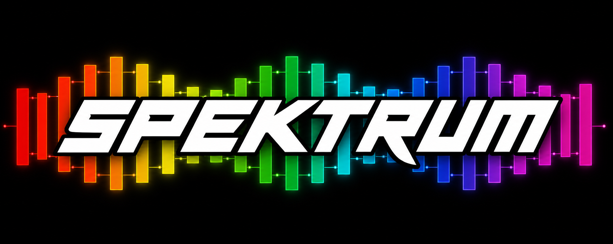

<p align="center">
  
</p>

[](https://www.npmjs.com/package/spektrum)
[](https://bundlephobia.com/package/spektrum)
[](LICENSE)
[](spektrum.d.ts)
[](package.json)
[](https://github.com/D-dezeeuw/spektrum/actions/workflows/ci.yml)
[](tests/)

**[Live demo →](https://d-dezeeuw.github.io/spektrum/example/)**

Spektrum is one file with zero runtime dependencies and no build step. The ~1,430 commented source lines audit in an afternoon, and there's nothing transitive to pick up someone else's CVE from. The same small footprint drops cleanly into a WordPress theme, an MV3 browser extension, an Electron renderer, or — once expressions are precompiled with `spektrum/compile` — a strict-CSP environment with no `unsafe-eval`. No SPA framework required.

At ~13 kB the whole engine fits in any LLM's context window in one tool call — so when an AI agent writes Spektrum code, it's working from the source, not a guess. `attempt()` is speculative execution as a primitive: try a change, run validation, commit or discard. `describe()` returns the full operational manifest. The MCP companion exposes the running app as a tool catalog any MCP-compatible agent can drive.

Every mutation flows through one path — the same path that updates the DOM also writes history. `replay(n)` reconstructs any past state, deterministically. Ship a serialized history with a bug report and QA reproduces the user's exact actions; build multi-step wizards with native undo; emit audit trails for compliance — all built into the primitive.

## What it is

A tiny templating engine with HTML-attribute bindings — `{{expr}}` for text, `:attr` for properties, `data-action` for events, `data-each` for lists, `data-model` for two-way inputs. CSP-safe via build-time precompile. Deterministic and synchronous: `replay(n)` returns to the same state every time. No virtual DOM, no proxies, no CSS-in-JS — the call stack in DevTools matches the source.

```html
<p>{{count}}</p>
<button data-action="click" data-fn="addValue" data-id="count" data-value="1" data-name="inc">+1</button>

<script type="module">
  import { setValue, bindDOM, run } from 'https://unpkg.com/spektrum';
  setValue('count', 0);
  bindDOM();  run();
</script>
```

That's a working reactive counter. Read the engine in an afternoon, or hand the whole file to an LLM in one tool call.

## Why

- **Time-travel.** Every mutation recorded. `replay(n)` rebuilds any past state. Undo / scrub / agent-rollback for free.
- **Auditable.** ~13 kB minified, ~6 kB gzipped, ~1,430 lines, single file, **zero runtime dependencies**.
- **Drop-in.** ESM from a `<script type="module">` — works in plain HTML, a WordPress theme, a browser extension, an Electron renderer, anywhere.
- **CSP-safe.** Strict-CSP via `spektrum/compile`.
- **Agent-native.** `describe()` returns the full operational manifest. `attempt()` is speculative execution. Mount an in-page LLM panel in 5 lines.

## Install

```bash
npm install spektrum
```

Or load from a CDN with an importmap so every subpath keeps its bare specifier:

```html
<script type="importmap">
{
  "imports": {
    "spektrum":          "https://unpkg.com/spektrum",
    "spektrum/devtools": "https://unpkg.com/spektrum/companions/spektrum-devtools.min.js",
    "spektrum/persist":  "https://unpkg.com/spektrum/companions/spektrum-persist.min.js",
    "spektrum/inspect":  "https://unpkg.com/spektrum/companions/spektrum-inspect.min.js",
    "spektrum/dock":     "https://unpkg.com/spektrum/companions/spektrum-dock.min.js",
    "spektrum/mcp":      "https://unpkg.com/spektrum/companions/spektrum-mcp.min.js",
    "spektrum/agent":    "https://unpkg.com/spektrum/companions/spektrum-agent.min.js"
  }
}
</script>
```

For production, pin the version: `https://unpkg.com/spektrum@<version>`.

## Documentation

The depth lives in [`docs/`](docs/). Single source of truth, plain Markdown.

| Doc | What's in it |
| --- | --- |
| [Bindings](docs/bindings.md) | `{{expr}}`, `:attr`, `data-if`, `data-each` (with container-not-template rule + reconciliation modes), `data-model`, `data-action`, `data-ref`, `data-intent`, `data-cloak`, URL-attribute safety |
| [Public API](docs/api.md) | Every export, with examples — `setValue`, `addAsync` / `refresh`, `computed`, `addSystem`, `defineFn`, agent surface |
| [Time-travel](docs/time-travel.md) | `replay`, `checkpoint`, `forks`, snapshots, devtools scrubber |
| [Subpath modules](docs/modules.md) | `devtools` / `persist` / `compile` / `mcp` / `agent` / `inspect` / `dock` |
| [Agent workflow](AGENTS.md) | Orient → speculate → explain → commit. Covers the in-page agent panel and MCP catalog |
| [CSP guide](docs/csp.md) | Strict-CSP deployments via build-time precompile |
| [Constraints](docs/constraints.md) | Non-negotiables that gate every feature |
| [Trade-offs](docs/trade-offs.md) | Deliberate design choices and their rationale |
| [Philosophy](docs/philosophy.md) | Non-goals; the engine in three sentences |

## For AI agents

Discovery is layered so an agent loads only what the task needs:

1. **[`llms.txt`](llms.txt)** — one-page map of everything, with the assumption-breakers (how Spektrum differs from Vue/React/Alpine) up front. Start here.
2. **[`AGENTS.md`](AGENTS.md)** — driving a *running* Spektrum app (orient → speculate → explain → commit) and making apps agent-ready.
3. **[`.claude/skills/spektrum/SKILL.md`](.claude/skills/spektrum/SKILL.md)** — auto-loads as the `spektrum` skill in Claude Code: mental model, current idioms, gotchas, task→doc router.
4. **[`docs/`](docs/)** and **[`spektrum.js`](spektrum.js)** — the depth; the source wins every disagreement.

The npm package ships `llms.txt`, `AGENTS.md`, and `docs/` alongside the code, so agents working inside `node_modules/spektrum` see the same layers. At runtime, `describe()` returns the running app's full operational manifest in one call.

## Built with Spektrum

| App | What it is | Live | Source |
| --- | --- | --- | --- |
| **SKYo** | Hourly weather, single page | [d-dezeeuw.github.io/hourly-weather](https://d-dezeeuw.github.io/hourly-weather/) | [github.com/D-dezeeuw/hourly-weather](https://github.com/D-dezeeuw/hourly-weather) |
| **Devworld26 guide** | Conference schedule navigator | [d-dezeeuw.github.io/my-confs](https://d-dezeeuw.github.io/my-confs/) | [github.com/D-dezeeuw/my-confs](https://github.com/D-dezeeuw/my-confs) |
| **Subgenre Playlists** | Spotify playlist builder with AI track suggestions, SSE-streamed search, nested subgenre/track state | — | [github.com/D-dezeeuw/spotify-subgenre-playlists](https://github.com/D-dezeeuw/spotify-subgenre-playlists) |
| **Spektrum demo** | Counter + basket reference, two isolated instances, devtools, persist, inspect, agent | [d-dezeeuw.github.io/spektrum/example](https://d-dezeeuw.github.io/spektrum/example/) | [example/](example/) |

Shipped something on Spektrum? Open a PR adding it here.

## License

[MIT](LICENSE). Browser & Node support, dev commands → [docs](docs/README.md#compatibility). Contributing → [CONTRIBUTING.md](CONTRIBUTING.md). Security disclosures → [SECURITY.md](SECURITY.md).
